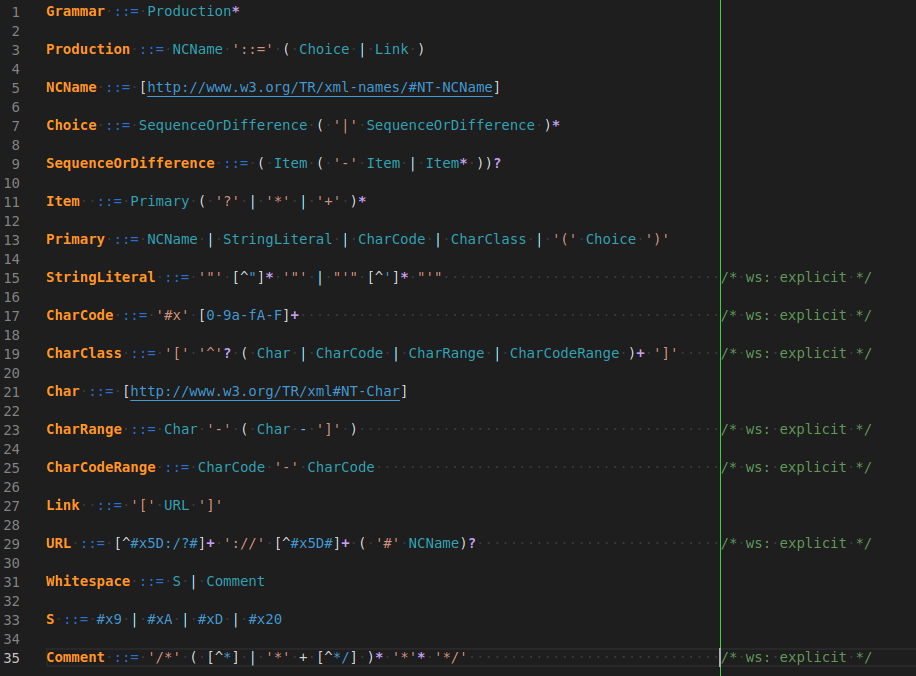
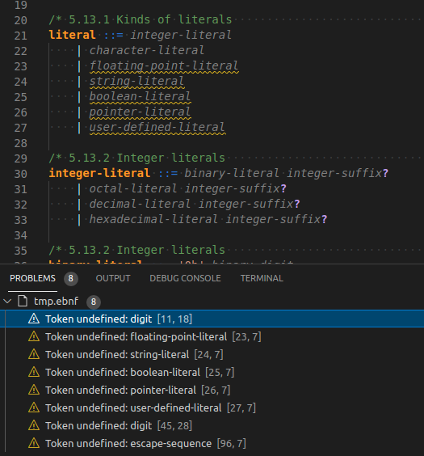
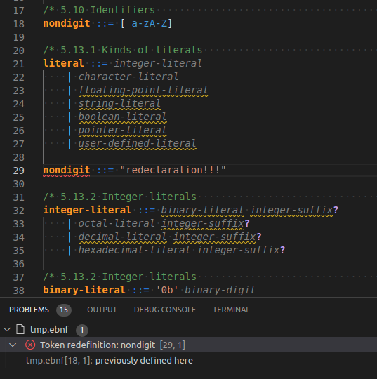

# vscode-rrebnf

This VSCode extension provides Extended Backus–Naur Form syntax highlighting.

Grammar is taken from [Railroad Diagram Generator](https://www.bottlecaps.de/rr/ui)

## Features

- Provides syntax highlighting for files with extension '.ebnf'



- Colours maybe customized by adopting `settings.json`

Screenshot above was taken with using the following theme customization:
```json
{
    "editor.tokenColorCustomizations": {
        "textMateRules": [
            {
                "scope": "entity.name.declaration.ebnf",
                "settings": {
                    "foreground": "#ff9404",
                    "fontStyle": "bold"
                }
            },
            {
                "scope": "entity.name.ebnf",
                "settings": {
                    "foreground": "#4ea5b6",
                }
            },
            {
                "scope": "keyword.operator.new.ebnf",
                "settings": {
                    "foreground": "#3875d7",
                }
            },
            {
                "scope": "keyword.operator.alternative.ebnf",
                "settings": {
                    "foreground": "#b4e4fd",
                }
            },
            {
                "scope": "keyword.operator.quantifier.ebnf",
                "settings": {
                    "foreground": "#c0a0f3",
                    "fontStyle": "bold"
                }
            },
            {
                "scope": "keyword.operator.difference.ebnf",
                "settings": {
                    "foreground": "#7cbdf1",
                }
            },
        ]
    }
}
```

- Provides diagnostics
  - Used but undefined tokens



  - Redefined tokens



## Requirements

- It is required to split every rule with blank line
- requires [HyperScopes](https://marketplace.visualstudio.com/items?itemName=draivin.hscopes) extension installed

## Extension Settings

- No settings provided
## Known Issues

- Grammar doesn't recognize links
- Used non standard token classes
- HyperScopes extension works not perfectly and provides not reliable output ([hscopes/issues/2](https://github.com/draivin/hscopes/issues/2)). Diagnostics features may require another approach for implementation.

## Release Notes

### 0.0.4
- include guard support (``ifndef`` ``define`` ``endif``)
- tests

### 0.0.3
- support for preprocessor directive ``#include``
### 0.0.2
- experimental diagnostics implementation
### 0.0.1

- initial release with more or less stable tokenization


-----------------------------------------------------------------------------------------------------------


### Links which were useful during development

* [syntax: ONIG_SYNTAX_ONIGURUMA (default syntax)](https://github.com/kkos/oniguruma/blob/master/doc/RE)
* [rubular](https://rubular.com/)
* [A guide to writing a language grammar (TextMate) in Atom](https://gist.github.com/Aerijo/b8c82d647db783187804e86fa0a604a1)
* [Writing a TextMate Grammar: Some Lessons Learned](https://www.apeth.com/nonblog/stories/textmatebundle.html)
* [Notes on how to create a Language Grammar and Custom Theme for a Textmate Bundle](https://benparizek.com/notebook/notes-on-how-to-create-a-language-grammar-and-custom-theme-for-a-textmate-bundle)